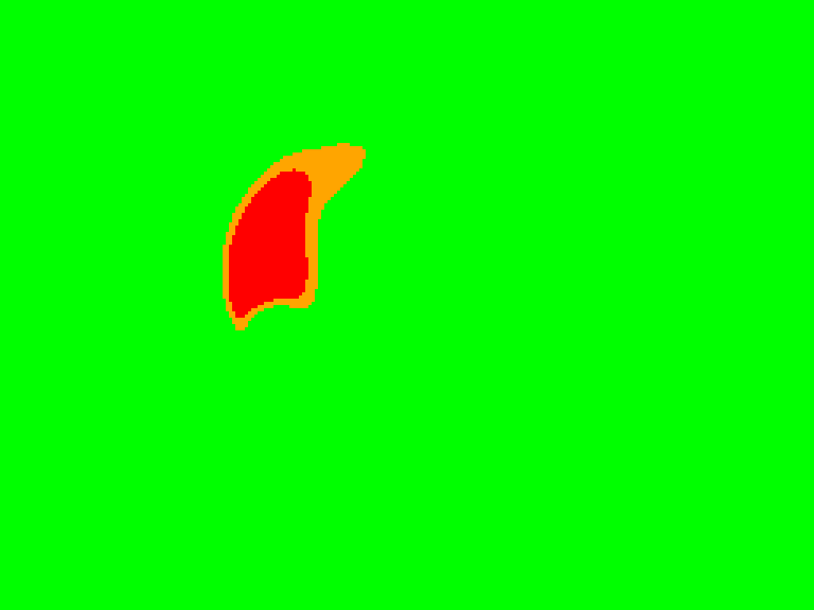

# 🚀 Jetson Orin Nano Live Deployment Artifacts

This directory houses the **actual, empirical hardware execution assets** generated during the deployment of our fire detection model on the target edge computer. 

### 🗂️ Asset Directory Map:

1. **`decision_node.py`**: The production ROS2 Humble node running inside the Docker container. It includes our custom, interrupt-driven multi-sensor fusion alert layer.
2. **`best.engine`**: The optimized NVIDIA TensorRT deployment model (~8.9 MB), compiled directly on the Jetson Orin Nano's Ampere architecture using FP16 precision.
3. **`trtexec_performance.txt`**: Raw, unmodified benchmark log from the NVIDIA TensorRT profiler proving a processing capacity of **264.31 FPS** and a median GPU inference of **3.72 ms**.
4. **`decision_log.csv`**: Live telemetry matrix generated during the physical laboratory validation, capturing coordinates, pixel clusters, and distance constraints in real time.
5. **`bitmap/`**: A dedicated subdirectory containing 17 sequential radiometric heatmaps captured during the laboratory tests. It includes **`bitmap_162105_CRITICAL.png`**, the empirical evidence saved instantly by the pipeline during the controlled laboratory ignition test.

---

### 🖼️ Controlled Laboratory Ignition Test Proof
Below is the instant hardware snapshot (`bitmap/bitmap_162105_CRITICAL.png`) extracted during the controlled laboratory ignition test. The red core pinpoints the exact structural location of the flame exceeding 60°C, perfectly cross-referenced with the spatial depth metrics.

---

### ⚙️ Multi-Sensor Operational Logic
The system cross-references the YOLOv8 visual inference with the raw matrices from the **UNI-T UTi721M Thermal Camera (USB)** and **Intel RealSense D435** cameras using the following constraints:
* **Thermal Trigger:** > 60.0°C (`THERMAL_DANGEROUS`)
* **Spatial Guard:** 50mm - 300mm (`DEPTH_MAX_VALID`) to filter optical reflections.
* **Clustering Guard:** > 5 connected pixels to filter sensor array grid noise.

---

### 🤝 Credits & Acknowledgements
The original ROS2 sensor fusion pipeline and edge hardware topology were developed by my colleague **Gizem**. 

The `decision_node.py` script provided in this directory is a modified version of her original work, specifically adapted during our joint laboratory tests to instantly capture empirical thermal evidence (`CRITICAL.png` snapshots) upon threat detection. 

**Note on System Boundaries:** YOLOv8 TensorRT inference is executed via the `inference_node.py` developed by Gizem. The component modified and shared in this repository is strictly the `decision_node.py` decision node, which interprets the `/fused/output_v2` data to trigger alerts.

For the complete Jetson Orin Nano hardware pipeline, please visit her original repository: 
🔗 **[Gizem's Edge AI Pipeline Repository](https://github.com/gizemezer/jetson-edge-ai-pipeline)**